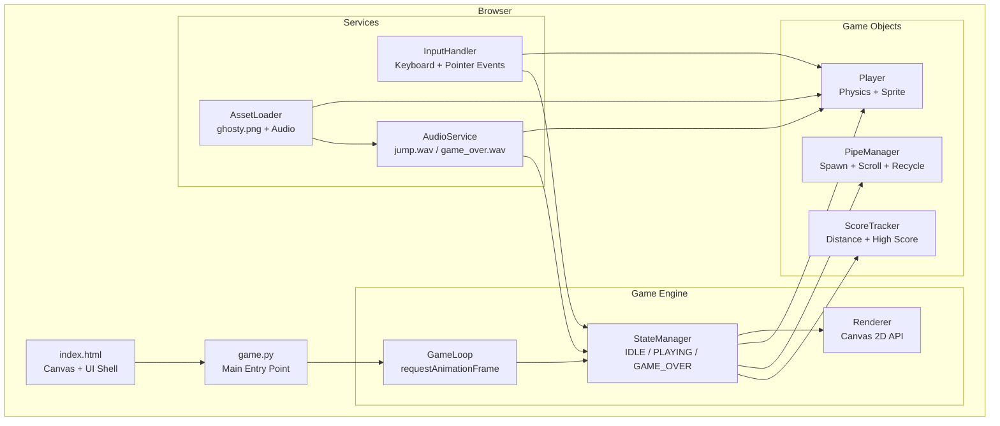
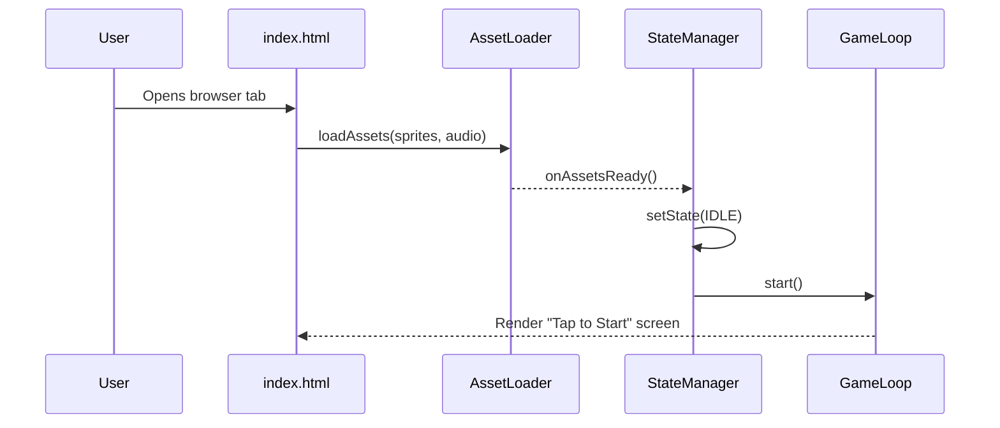
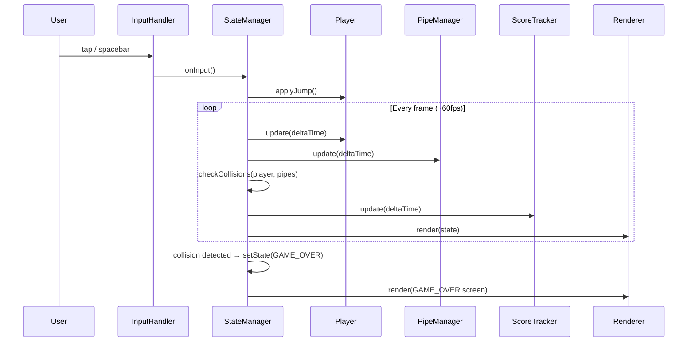
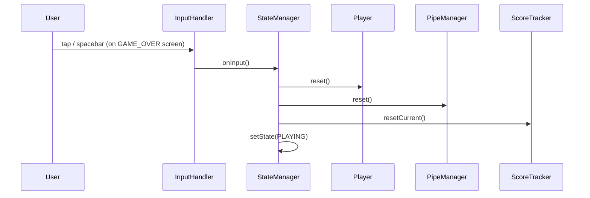

# Design Document: Flappy Kiro — Endless Runner

## Overview

Flappy Kiro is a browser-based endless runner game inspired by Flappy Bird. The player controls the Kiro character (represented by the `ghosty.png` sprite) and must navigate through gaps between oncoming pipe pairs. The game runs entirely in the browser using HTML5 Canvas and Python, requiring no external dependencies or build tools.

The game loop drives continuous pipe generation, physics updates, collision detection, and score tracking. Audio feedback is provided via the existing `jump.wav` and `game_over.wav` assets. The player taps or clicks (or presses Space/Up arrow) to apply an upward impulse to the Kiro character, fighting against constant gravity.

## Architecture



## Sequence Diagrams

### Game Startup Flow



### Gameplay Loop



### Restart Flow



## Components and Interfaces

### GameLoop

**Purpose**: Drives the game at a consistent frame rate using `requestAnimationFrame`. Computes delta time between frames and dispatches updates to the `StateManager`.

**Interface**:
```python
class GameLoop(ABC):                                                            
    @abstractmethod                                                             
    def start(self) -> None:                                                    
        pass                                                                    
                                                                                
    @abstractmethod                                                             
    def stop(self) -> None:                                                     
        pass                                                                    
                                                                                
    @abstractmethod                                                             
    def on_tick(self, delta_time: float) -> None:
        pass  
```

**Responsibilities**:
- Request next animation frame each tick
- Compute `deltaTime` (capped at ~100ms to prevent spiral-of-death on tab switch)
- Dispatch `tick(deltaTime)` to `StateManager`

---

### StateManager

**Purpose**: Owns the current game state (`IDLE`, `PLAYING`, `GAME_OVER`) and orchestrates all per-frame logic by delegating to game objects.

**Interface**:
```python
class State(Enum):
    IDLE = auto() 
    PLAYING = auto()
    GAME_OVER = auto()
    
@dataclass
class GameState:
    current: State = State.IDLE

class GameLoop(ABC): # Main function
    @abstractmethod                                                             
    def getState(self) -> GameState:                                                    
        pass                                                                    
                                                                                
    @abstractmethod                                                             
    def setState(self, state: GameState) -> None:
        pass                                                                    
                                                                                
    @abstractmethod                                                             
    def tick(self, delta_time: float) -> None:
        pass  

    @abstractmethod
    def onInput(self) -> None:
      pass
```

**Responsibilities**:
- Route per-frame updates to `Player`, `PipeManager`, and `ScoreTracker` (only when `PLAYING`)
- Run collision detection between `Player` and all active pipes each frame
- Trigger `AudioService.playGameOver()` and transition to `GAME_OVER` on collision or out-of-bounds
- Coordinate reset of all subsystems on restart

---

### Player

**Purpose**: Represents the Kiro character. Owns its own physics state (position, velocity) and renders the `ghosty.png` sprite.

**Interface**:
```python
class Player: 
  def __init__(self, position: Vector2, velocity: Vector2, bounds: Rect):
    self.position = position          // { x, y } in canvas pixels
    self.velocity = vector2
    self.bounds = bounds               // axis-aligned bounding box for collision

  @abstractmethod
  def applyJump() -> None           // set upward vertical velocity
    pass
  update(deltaTime: number): void  // apply gravity + integrate velocity
  render(ctx: CanvasRenderingContext2D): void
  reset(): void              // restore to initial spawn position + velocity
```

**Responsibilities**:
- Apply a constant downward gravity each frame
- Clamp velocity to a terminal velocity to keep physics predictable
- Fixed horizontal position (the world scrolls past the player)
- Play `jump.wav` via `AudioService` on `applyJump()`

---

### PipeManager

**Purpose**: Generates, scrolls, and recycles pipe pairs. A "pipe pair" consists of a top pipe and a bottom pipe with a configurable gap between them.

**Interface**:
```typescript
interface PipePair {
  x: number          // current horizontal position
  gapY: number       // y-coordinate of the center of the gap
  gapSize: number    // height of the gap in pixels
  scored: boolean    // true once the player has passed this pair
  bounds: {
    top: Rect        // bounding box of the top pipe segment
    bottom: Rect     // bounding box of the bottom pipe segment
  }
}

interface PipeManager {
  activePipes: PipePair[]
  update(deltaTime: number): void   // scroll pipes left, spawn new ones, recycle off-screen ones
  render(ctx: CanvasRenderingContext2D): void
  reset(): void
}
```

**Responsibilities**:
- Spawn a new `PipePair` at a fixed interval (e.g. every 1.5 seconds)
- Randomise `gapY` within safe vertical bounds on each spawn
- Scroll all active pipes leftward at the current game speed each frame
- Recycle (remove) pipes that have scrolled fully off the left edge
- Increase scroll speed gradually over time to increase difficulty

---

### ScoreTracker

**Purpose**: Tracks the player's current score (incremented each time a pipe pair is passed) and persists the high score to `localStorage`.

**Interface**:
```typescript
interface ScoreTracker {
  currentScore: number
  highScore: number

  update(pipes: PipePair[]): void  // increment score when player clears a pipe
  resetCurrent(): void
  render(ctx: CanvasRenderingContext2D): void
}
```

**Responsibilities**:
- Detect when the player's x position crosses a pipe's x position (using `PipePair.scored` flag to avoid double-counting)
- Load `highScore` from `localStorage` on initialisation
- Persist new high score to `localStorage` on `GAME_OVER`

---

### InputHandler

**Purpose**: Listens for all user input events and translates them to game actions.

**Interface**:
```typescript
interface InputHandler {
  register(canvas: HTMLCanvasElement): void
  onAction(callback: () => void): void  // fires on jump/start/restart intent
}
```

**Responsibilities**:
- Listen for `keydown` (Space, ArrowUp) and `pointerdown` (mouse + touch) events
- Ignore rapid duplicate events within the same frame (debounce)
- Call registered `onAction` callback, which `StateManager.onInput()` is bound to

---

### Renderer

**Purpose**: Draws all visual game elements to the HTML5 Canvas each frame in the correct z-order.

**Interface**:
```typescript
interface Renderer {
  canvas: HTMLCanvasElement
  ctx: CanvasRenderingContext2D

  clear(): void
  drawBackground(): void
  render(state: GameState, player: Player, pipes: PipeManager, score: ScoreTracker): void
  drawOverlay(state: GameState): void  // IDLE splash or GAME_OVER screen
}
```

**Responsibilities**:
- Clear canvas each frame
- Draw background (solid sky colour or scrolling background)
- Delegate to `Player.render()`, `PipeManager.render()`, `ScoreTracker.render()`
- Draw semi-transparent overlays for IDLE and GAME_OVER states

---

### AudioService

**Purpose**: Wraps browser `Audio` API to play sound effects with minimal latency.

**Interface**:
```typescript
interface AudioService {
  playJump(): void
  playGameOver(): void
}
```

**Responsibilities**:
- Preload `assets/jump.wav` and `assets/game_over.wav` on initialisation
- Clone audio nodes (`Audio.cloneNode()`) for overlapping playback support
- Handle browsers that block autoplay by deferring playback until first user interaction

---

### AssetLoader

**Purpose**: Loads and caches all static assets (images and audio) before the game starts.

**Interface**:
```typescript
interface AssetLoader {
  load(assets: AssetManifest): Promise<AssetCache>
}

interface AssetManifest {
  images: Record<string, string>   // { "player": "assets/ghosty.png" }
  audio: Record<string, string>    // { "jump": "assets/jump.wav", ... }
}

interface AssetCache {
  images: Record<string, HTMLImageElement>
  audio: Record<string, HTMLAudioElement>
}
```

**Responsibilities**:
- Load all assets in parallel using `Promise.all`
- Resolve the promise only when all assets are ready
- Expose a typed cache so components can retrieve assets by name

---

## Data Models

### Vector2

```typescript
interface Vector2 {
  x: number
  y: number
}
```

### Rect (Axis-Aligned Bounding Box)

```typescript
interface Rect {
  x: number       // left edge
  y: number       // top edge
  width: number
  height: number
}
```

Used for all collision detection. Two rects overlap when:
- `a.x < b.x + b.width && a.x + a.width > b.x`
- `a.y < b.y + b.height && a.y + a.height > b.y`

### GameConfig

Central configuration object — tuning these values changes game feel.

```typescript
interface GameConfig {
  canvas: {
    width: number          // e.g. 480
    height: number         // e.g. 640
  }
  player: {
    x: number              // fixed horizontal position, e.g. 100
    startY: number         // vertical spawn position
    gravity: number        // pixels/s² downward, e.g. 1800
    jumpVelocity: number   // upward impulse in px/s, e.g. -500
    terminalVelocity: number  // max fall speed, e.g. 800
    spriteWidth: number
    spriteHeight: number
  }
  pipes: {
    width: number          // pipe segment width, e.g. 60
    gapSize: number        // vertical gap between pipe pair, e.g. 150
    spawnInterval: number  // ms between spawns, e.g. 1500
    initialScrollSpeed: number   // px/s, e.g. 180
    speedIncrement: number       // px/s added every 10 points
    minGapY: number        // min center of gap from top
    maxGapY: number        // max center of gap from top
  }
}
```

### GameSnapshot (passed to Renderer each frame)

```typescript
interface GameSnapshot {
  state: GameState
  player: Player
  pipes: PipeManager
  score: ScoreTracker
}
```

## Error Handling

### Asset Load Failure

**Condition**: An image or audio file fails to load (404, network error)
**Response**: `AssetLoader` rejects its promise; the game displays a static error message on the canvas ("Failed to load assets — please refresh")
**Recovery**: User refreshes the page

### Audio Autoplay Blocked

**Condition**: Browser blocks audio playback before first user interaction
**Response**: `AudioService` catches the rejected `play()` promise silently; no sound plays until the first `pointerdown` or `keydown` event
**Recovery**: Audio resumes automatically on first valid input

### Canvas Not Supported

**Condition**: `canvas.getContext('2d')` returns `null` (very old browser)
**Response**: Display a `<noscript>`-style fallback message in the HTML encouraging an updated browser
**Recovery**: User upgrades browser

### Tab Becomes Inactive

**Condition**: User switches away; `deltaTime` spikes to several seconds on return
**Response**: `GameLoop` caps `deltaTime` at 100ms per tick to prevent physics from exploding
**Recovery**: Game resumes from the capped tick seamlessly

## Testing Strategy

### Unit Testing Approach

Test pure logic in isolation — physics calculations, collision detection, scoring, and config validation are all side-effect-free functions that are straightforward to unit test.

Key test cases:
- `applyGravity(velocity, gravity, deltaTime)` → correct velocity integration
- `rectsOverlap(a, b)` → true/false for edge cases (touching edges = no collision)
- `ScoreTracker.update()` → score increments exactly once per pipe pair
- `GameConfig` default values are within valid ranges

### Property-Based Testing Approach

**Property Test Library**: fast-check

Properties to verify:
- For any `deltaTime` in `[0, 100]ms`, `Player.velocity.y` never exceeds `terminalVelocity`
- For any valid `gapY` in `[minGapY, maxGapY]`, the gap never clips the top or bottom of the canvas
- Score is always non-negative and monotonically non-decreasing during a session
- Pipe pairs scrolled off the left edge are always removed from `activePipes`

### Integration Testing Approach

- Simulate a full tick sequence: spawn pipes → update player → detect collision → state transitions correctly to `GAME_OVER`
- Verify high score persists to and loads from `localStorage` across simulated page loads
- Validate that `AssetLoader` resolves correctly given mock `HTMLImageElement` and `HTMLAudioElement` stubs

## Performance Considerations

- **Object pooling**: `PipeManager` recycles `PipePair` objects rather than allocating new ones each spawn, keeping GC pressure low during long sessions
- **Single canvas layer**: All rendering happens on one `<canvas>` element; no DOM manipulation occurs during the game loop
- **60 fps target**: `requestAnimationFrame` naturally syncs to display refresh rate; delta-time-based physics ensures identical behaviour at any frame rate
- **Asset caching**: All assets loaded once at startup; no I/O during gameplay

## Security Considerations

- **No server communication**: The game is entirely client-side. No user data is transmitted anywhere.
- **localStorage scope**: Only `highScore` (a non-negative integer) is stored. No PII is ever written.
- **Input sanitisation**: Not applicable — all input is translated to a single binary jump action; no text input exists.

## Dependencies

| Dependency | Purpose | Source |
|---|---|---|
| `ghosty.png` | Kiro character sprite | `assets/ghosty.png` (existing) |
| `jump.wav` | Jump sound effect | `assets/jump.wav` (existing) |
| `game_over.wav` | Game over sound effect | `assets/game_over.wav` (existing) |
| Browser Canvas 2D API | Rendering | Built into all modern browsers |
| `requestAnimationFrame` | Game loop timing | Built into all modern browsers |
| `localStorage` | High score persistence | Built into all modern browsers |
| fast-check | Property-based testing | npm (dev dependency only) |

No runtime npm dependencies are required. The game ships as plain HTML + JS files.
