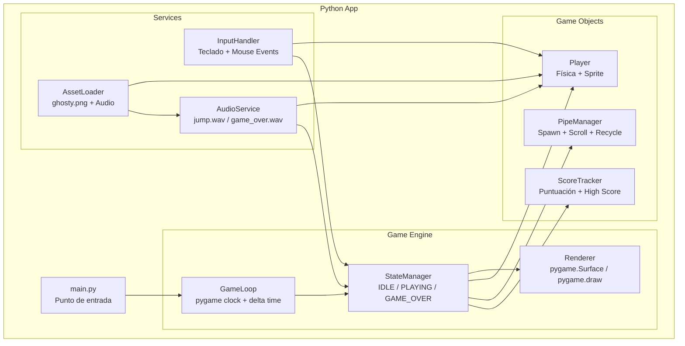
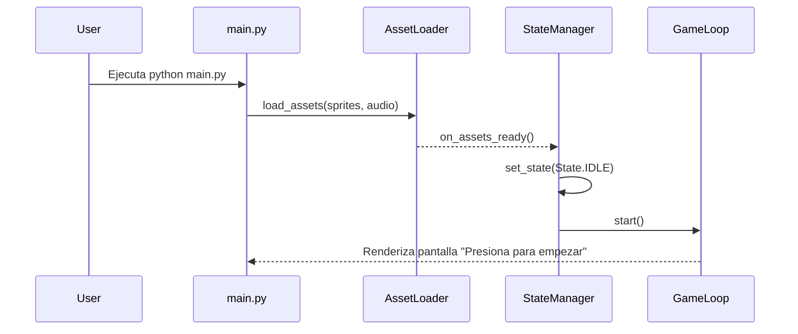
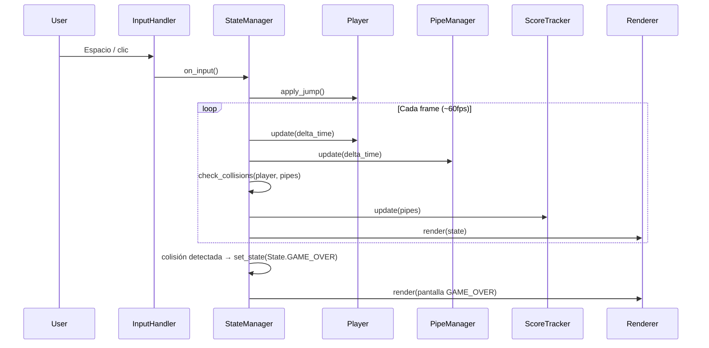
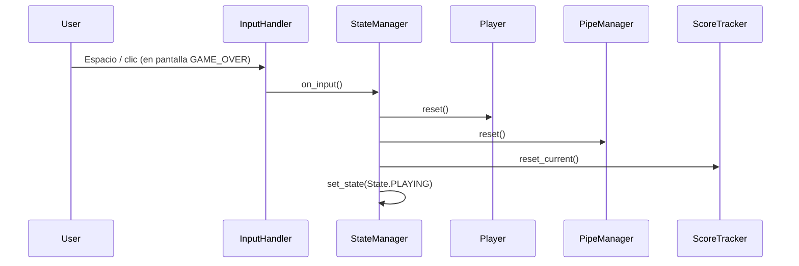

# Design Document: Flappy Kiro — Endless Runner

## Overview

Flappy Kiro es un juego endless runner de escritorio inspirado en Flappy Bird. El jugador controla al personaje Kiro (representado por el sprite `ghosty.png`) y debe navegar por los espacios entre pares de tuberías que se aproximan. El juego se ejecuta completamente en Python usando **pygame**, sin dependencias externas de producción más allá de esa librería.

El game loop impulsa la generación continua de tuberías, las actualizaciones de física, la detección de colisiones y el seguimiento de puntuación. El audio se provee mediante los assets existentes `jump.wav` y `game_over.wav`. El jugador presiona Espacio o la flecha arriba (o hace clic) para aplicar un impulso hacia arriba al personaje Kiro, luchando contra la gravedad constante.

## Architecture



## Sequence Diagrams

### Game Startup Flow



### Gameplay Loop



### Restart Flow



## Components and Interfaces

### GameLoop

**Purpose**: Conduce el juego a una tasa de frames consistente usando `pygame.time.Clock`. Calcula el delta time entre frames y despacha actualizaciones al `StateManager`.

**Interface**:
```python
from abc import ABC, abstractmethod

class GameLoop(ABC):
    @abstractmethod
    def start(self) -> None:
        """Inicia el bucle principal del juego."""
        pass

    @abstractmethod
    def stop(self) -> None:
        """Detiene el bucle y cierra pygame."""
        pass

    @abstractmethod
    def on_tick(self, delta_time: float) -> None:
        """Llamado cada frame con delta_time en segundos (máx 0.1s)."""
        pass
```

**Responsibilities**:
- Usar `pygame.time.Clock.tick(60)` para limitar a 60 fps y obtener el tiempo transcurrido
- Convertir el tiempo de milisegundos a segundos y caparlo a 0.1s para evitar explosiones de física
- Despachar `state_manager.tick(delta_time)` cada frame
- Procesar eventos de `pygame.event.get()` y pasarlos al `InputHandler`

---

### StateManager

**Purpose**: Posee el estado actual del juego (`IDLE`, `PLAYING`, `GAME_OVER`) y orquesta toda la lógica por frame delegando a los objetos del juego.

**Interface**:
```python
from enum import Enum, auto
from abc import ABC, abstractmethod

class State(Enum):
    IDLE = auto()
    PLAYING = auto()
    GAME_OVER = auto()

class StateManager(ABC):
    @abstractmethod
    def get_state(self) -> State:
        pass

    @abstractmethod
    def set_state(self, state: State) -> None:
        pass

    @abstractmethod
    def tick(self, delta_time: float) -> None:
        """Actualiza todos los subsistemas y corre detección de colisiones."""
        pass

    @abstractmethod
    def on_input(self) -> None:
        """Llamado por InputHandler cuando el jugador activa la acción de salto."""
        pass
```

**Responsibilities**:
- Enrutar actualizaciones por frame a `Player`, `PipeManager` y `ScoreTracker` (solo en `PLAYING`)
- Correr detección de colisiones entre `Player` y todas las tuberías activas cada frame
- Disparar `AudioService.play_game_over()` y transicionar a `GAME_OVER` en colisión o fuera de límites
- Coordinar el reset de todos los subsistemas en reinicio

---

### Player

**Purpose**: Representa al personaje Kiro. Posee su propio estado de física (posición, velocidad) y renderiza el sprite `ghosty.png`.

**Interface**:
```python
from dataclasses import dataclass, field

@dataclass
class Player:
    position: Vector2
    velocity: Vector2
    bounds: Rect
    # Sprite cargado por AssetLoader
    sprite: pygame.Surface = field(default=None)

    def apply_jump(self) -> None:
        """Aplica impulso hacia arriba (velocidad negativa en Y)."""
        ...

    def update(self, delta_time: float) -> None:
        """Aplica gravedad e integra velocidad en la posición."""
        ...

    def render(self, surface: pygame.Surface) -> None:
        """Dibuja el sprite en la surface de pygame."""
        ...

    def reset(self) -> None:
        """Restaura posición y velocidad iniciales."""
        ...
```

**Responsibilities**:
- Aplicar gravedad constante hacia abajo cada frame: `velocity.y += gravity * delta_time`
- Limitar la velocidad al terminal velocity para mantener la física predecible
- Posición horizontal fija (el mundo se desplaza hacia el jugador)
- Reproducir `jump.wav` via `AudioService` en `apply_jump()`

---

### PipeManager

**Purpose**: Genera, desplaza y recicla pares de tuberías. Un "par de tuberías" consiste en una tubería superior y una inferior con una brecha configurable entre ellas.

**Interface**:
```python
from dataclasses import dataclass, field
from typing import List

@dataclass
class PipePair:
    x: float                # posición horizontal actual
    gap_y: float            # coordenada Y del centro de la brecha
    gap_size: float         # altura de la brecha en píxeles
    scored: bool = False    # True cuando el jugador ya pasó este par
    bounds_top: Rect = field(default=None)     # AABB de la tubería superior
    bounds_bottom: Rect = field(default=None)  # AABB de la tubería inferior

class PipeManager:
    active_pipes: List[PipePair]

    def update(self, delta_time: float) -> None:
        """Desplaza tuberías hacia la izquierda, genera nuevas, recicla las fuera de pantalla."""
        ...

    def render(self, surface: pygame.Surface) -> None:
        """Dibuja todas las tuberías activas."""
        ...

    def reset(self) -> None:
        """Elimina todas las tuberías activas y reinicia el temporizador de spawn."""
        ...
```

**Responsibilities**:
- Generar un nuevo `PipePair` a intervalo fijo (ej. cada 1.5 segundos)
- Aleatorizar `gap_y` dentro de límites verticales seguros en cada spawn
- Desplazar todas las tuberías activas hacia la izquierda a la velocidad actual cada frame
- Reciclar (eliminar) tuberías que se han desplazado completamente fuera del borde izquierdo
- Aumentar la velocidad de desplazamiento gradualmente con el tiempo para incrementar la dificultad

---

### ScoreTracker

**Purpose**: Rastrea la puntuación actual del jugador (incrementada cada vez que se pasa un par de tuberías) y persiste el high score en un archivo local.

**Interface**:
```python
class ScoreTracker:
    current_score: int
    high_score: int

    def update(self, pipes: List[PipePair], player: Player) -> None:
        """Incrementa puntuación cuando el jugador supera una tubería."""
        ...

    def reset_current(self) -> None:
        """Reinicia la puntuación actual a 0."""
        ...

    def save_high_score(self) -> None:
        """Persiste el high score en un archivo JSON local."""
        ...

    def render(self, surface: pygame.Surface) -> None:
        """Dibuja la puntuación actual y el high score en pantalla."""
        ...
```

**Responsibilities**:
- Detectar cuando la posición X del jugador supera la posición X de una tubería (usando el flag `PipePair.scored` para evitar doble conteo)
- Cargar `high_score` desde `scores.json` al inicializar
- Persistir nuevo high score en `scores.json` en `GAME_OVER`

---

### InputHandler

**Purpose**: Escucha todos los eventos de entrada del usuario y los traduce a acciones del juego.

**Interface**:
```python
from typing import Callable
import pygame

class InputHandler:
    def register(self, callback: Callable[[], None]) -> None:
        """Registra el callback que se llama al detectar acción de salto."""
        ...

    def process_event(self, event: pygame.event.Event) -> None:
        """Procesa un evento de pygame y dispara el callback si corresponde."""
        ...
```

**Responsibilities**:
- Escuchar `pygame.KEYDOWN` (K_SPACE, K_UP) y `pygame.MOUSEBUTTONDOWN`
- Ignorar eventos duplicados rápidos en el mismo frame (debounce)
- Llamar al callback registrado, al cual `StateManager.on_input()` está vinculado

---

### Renderer

**Purpose**: Dibuja todos los elementos visuales del juego en la `pygame.Surface` cada frame en el orden Z correcto.

**Interface**:
```python
import pygame

class Renderer:
    surface: pygame.Surface

    def clear(self) -> None:
        """Limpia la superficie con el color de fondo."""
        ...

    def draw_background(self) -> None:
        """Dibuja el fondo del juego."""
        ...

    def render(
        self,
        state: State,
        player: Player,
        pipe_manager: PipeManager,
        score_tracker: ScoreTracker,
    ) -> None:
        """Dibuja todos los elementos del frame actual."""
        ...

    def draw_overlay(self, state: State) -> None:
        """Dibuja overlay semitransparente para IDLE y GAME_OVER."""
        ...
```

**Responsibilities**:
- Limpiar la superficie cada frame
- Dibujar el fondo (color sólido o fondo con scroll)
- Delegar a `Player.render()`, `PipeManager.render()`, `ScoreTracker.render()`
- Dibujar overlays semitransparentes para los estados IDLE y GAME_OVER

---

### AudioService

**Purpose**: Envuelve `pygame.mixer` para reproducir efectos de sonido con mínima latencia.

**Interface**:
```python
import pygame

class AudioService:
    def play_jump(self) -> None:
        """Reproduce jump.wav."""
        ...

    def play_game_over(self) -> None:
        """Reproduce game_over.wav."""
        ...
```

**Responsibilities**:
- Precargar `assets/jump.wav` y `assets/game_over.wav` con `pygame.mixer.Sound` al inicializar
- Usar `Sound.play()` para reproducción de bajo impacto (pygame maneja la superposición)
- Manejar errores de carga de audio de forma silenciosa si los archivos no están disponibles

---

### AssetLoader

**Purpose**: Carga y cachea todos los assets estáticos (imágenes y audio) antes de que empiece el juego.

**Interface**:
```python
from dataclasses import dataclass
from typing import Dict
import pygame

@dataclass
class AssetManifest:
    images: Dict[str, str]  # { "player": "assets/ghosty.png" }
    audio: Dict[str, str]   # { "jump": "assets/jump.wav", ... }

@dataclass
class AssetCache:
    images: Dict[str, pygame.Surface]
    audio: Dict[str, pygame.mixer.Sound]

class AssetLoader:
    def load(self, manifest: AssetManifest) -> AssetCache:
        """Carga todos los assets del manifest y retorna el caché."""
        ...
```

**Responsibilities**:
- Cargar imágenes con `pygame.image.load()` y convertirlas con `.convert_alpha()`
- Cargar audio con `pygame.mixer.Sound()`
- Lanzar un error descriptivo si algún asset no se encuentra
- Exponer un caché tipado para que los componentes recuperen assets por nombre

---

## Data Models

### Vector2

```python
from dataclasses import dataclass

@dataclass
class Vector2:
    x: float
    y: float
```

### Rect (Axis-Aligned Bounding Box)

```python
from dataclasses import dataclass

@dataclass
class Rect:
    x: float      # borde izquierdo
    y: float      # borde superior
    width: float
    height: float

def rects_overlap(a: Rect, b: Rect) -> bool:
    """Retorna True si los dos rectángulos se superponen."""
    return (
        a.x < b.x + b.width and a.x + a.width > b.x and
        a.y < b.y + b.height and a.y + a.height > b.y
    )
```

Los bordes que se tocan no cuentan como colisión (comparación estricta).

### GameConfig

Objeto de configuración central — cambiar estos valores modifica la sensación del juego.

```python
from dataclasses import dataclass

@dataclass
class CanvasConfig:
    width: int = 480
    height: int = 640

@dataclass
class PlayerConfig:
    x: float = 100.0           # posición horizontal fija
    start_y: float = 300.0     # posición vertical de spawn
    gravity: float = 1800.0    # píxeles/s² hacia abajo
    jump_velocity: float = -500.0   # impulso hacia arriba en px/s
    terminal_velocity: float = 800.0  # velocidad máxima de caída
    sprite_width: int = 48
    sprite_height: int = 48

@dataclass
class PipesConfig:
    width: int = 60
    gap_size: int = 150          # brecha vertical entre par de tuberías
    spawn_interval: float = 1.5  # segundos entre spawns
    initial_scroll_speed: float = 180.0  # px/s
    speed_increment: float = 10.0        # px/s añadidos cada 10 puntos
    min_gap_y: int = 100         # mínimo centro de brecha desde arriba
    max_gap_y: int = 540         # máximo centro de brecha desde arriba

@dataclass
class GameConfig:
    canvas: CanvasConfig = None
    player: PlayerConfig = None
    pipes: PipesConfig = None

    def __post_init__(self):
        self.canvas = self.canvas or CanvasConfig()
        self.player = self.player or PlayerConfig()
        self.pipes = self.pipes or PipesConfig()
```

### GameSnapshot (pasado al Renderer cada frame)

```python
from dataclasses import dataclass

@dataclass
class GameSnapshot:
    state: State
    player: Player
    pipes: PipeManager
    score: ScoreTracker
```

## Correctness Properties

### Property 1: Límite de velocidad terminal
Para cualquier `delta_time` en `[0, 0.1]`s, `Player.velocity.y` nunca debe exceder `terminal_velocity` definida en `PlayerConfig`.

**Validates: Requirements 1.1**

### Property 2: Brecha de tuberías dentro del canvas
Para cualquier `gap_y` válido en `[min_gap_y, max_gap_y]`, la brecha de la tubería nunca debe recortar la parte superior o inferior del canvas.

**Validates: Requirements 2.1**

### Property 3: Puntuación monótonamente no decreciente
La puntuación es siempre no negativa y monótonamente no decreciente durante una sesión de juego activa.

**Validates: Requirements 3.1**

### Property 4: Reciclado de tuberías fuera de pantalla
Los pares de tuberías desplazados completamente fuera del borde izquierdo del canvas siempre se eliminan de `active_pipes`.

**Validates: Requirements 2.2**

### Property 5: Conmutatividad de la detección de colisiones
`rects_overlap(a, b)` es conmutativo: `rects_overlap(a, b) == rects_overlap(b, a)` para cualquier par de rectángulos.

**Validates: Requirements 1.2**

## Error Handling

### Asset Load Failure

**Condición**: Un archivo de imagen o audio no se encuentra (ruta incorrecta, archivo faltante)
**Respuesta**: `AssetLoader` lanza `FileNotFoundError` con mensaje descriptivo; `main.py` lo captura y muestra el error en consola antes de cerrar pygame
**Recuperación**: El usuario verifica que los assets estén en la carpeta `assets/`

### Audio No Disponible

**Condición**: `pygame.mixer` no puede inicializar (sin dispositivo de audio)
**Respuesta**: `AudioService` captura la excepción silenciosamente en la inicialización; el juego continúa sin audio
**Recuperación**: El juego funciona completamente sin sonido

### Ventana Cerrada por el Sistema

**Condición**: El usuario cierra la ventana o el OS termina el proceso
**Respuesta**: `GameLoop` maneja el evento `pygame.QUIT` y llama a `stop()` para liberar recursos y salir limpiamente con `pygame.quit()`
**Recuperación**: No aplica

### Ventana Inactiva / Frame Spike

**Condición**: El usuario minimiza la ventana; `delta_time` aumenta al volver
**Respuesta**: `GameLoop` capa `delta_time` a 0.1s por tick para evitar explosiones de física
**Recuperación**: El juego retoma desde el tick limitado de forma transparente

## Testing Strategy

### Unit Testing Approach

Testear lógica pura en aislamiento — cálculos de física, detección de colisiones, puntuación y validación de configuración son funciones sin efectos secundarios directas de probar con `pytest`.

Casos de prueba clave:
- `apply_gravity(velocity, gravity, delta_time)` → integración correcta de velocidad
- `rects_overlap(a, b)` → True/False para casos borde (bordes tocándose = sin colisión)
- `ScoreTracker.update()` → la puntuación se incrementa exactamente una vez por par de tuberías
- `GameConfig` valores por defecto están dentro de rangos válidos

### Property-Based Testing Approach

**Librería**: `hypothesis`

Propiedades a verificar:
- Para cualquier `delta_time` en `[0, 0.1]`s, `Player.velocity.y` nunca excede `terminal_velocity`
- Para cualquier `gap_y` válido en `[min_gap_y, max_gap_y]`, la brecha nunca recorta el canvas
- La puntuación es siempre no negativa y monótonamente no decreciente durante una sesión
- Los pares de tuberías fuera de pantalla siempre se eliminan de `active_pipes`

### Integration Testing Approach

- Simular una secuencia completa de ticks: spawn tuberías → actualizar player → detectar colisión → estado transiciona correctamente a `GAME_OVER`
- Verificar que el high score persiste y se carga correctamente desde `scores.json`
- Validar que `AssetLoader` resuelve correctamente dado mocks de `pygame.Surface` y `pygame.mixer.Sound`

## Performance Considerations

- **Object pooling**: `PipeManager` recicla objetos `PipePair` en lugar de alocar nuevos en cada spawn, manteniendo baja la presión del GC durante sesiones largas
- **Surface única**: Todo el rendering ocurre en una sola `pygame.Surface`; no hay manipulación del DOM durante el game loop
- **Target 60 fps**: `pygame.time.Clock.tick(60)` limita la tasa de frames; la física basada en delta-time asegura comportamiento idéntico a cualquier tasa de frames
- **Asset caching**: Todos los assets se cargan una vez al inicio; no hay I/O durante el gameplay

## Security Considerations

- **Sin comunicación de red**: El juego es completamente local. No se transmite ningún dato de usuario.
- **Scope del archivo de puntuaciones**: Solo `high_score` (un entero no negativo) se guarda en `scores.json`. No se almacena PII.
- **Sanitización de entrada**: No aplica — toda la entrada se traduce a una única acción binaria de salto; no existe entrada de texto.

## Dependencies

| Dependencia | Propósito | Fuente |
|---|---|---|
| `ghosty.png` | Sprite del personaje Kiro | `assets/ghosty.png` (existente) |
| `jump.wav` | Efecto de sonido de salto | `assets/jump.wav` (existente) |
| `game_over.wav` | Efecto de sonido de fin de juego | `assets/game_over.wav` (existente) |
| `pygame` | Rendering, audio, input, game loop | `pip install pygame` |
| `hypothesis` | Tests basados en propiedades | `pip install hypothesis` (dev) |
| `pytest` | Framework de testing | `pip install pytest` (dev) |

No se requieren dependencias de producción más allá de `pygame`. El juego se ejecuta con `python main.py`.
