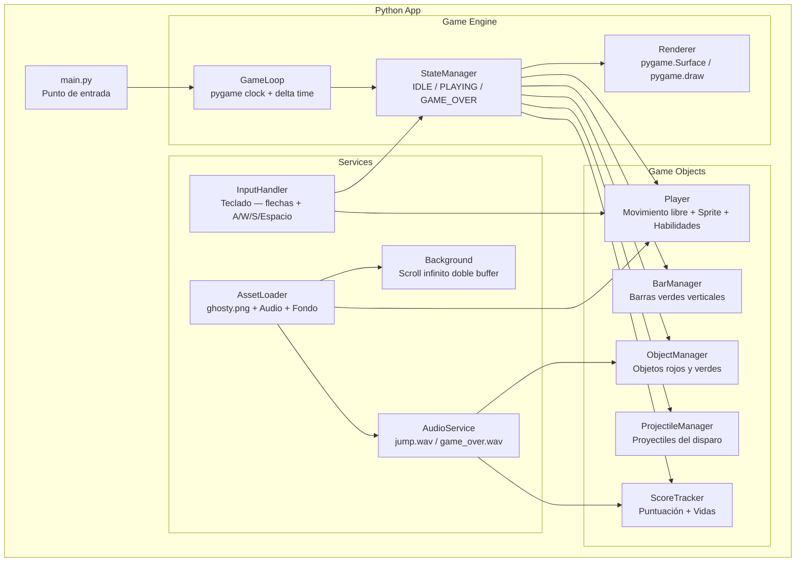
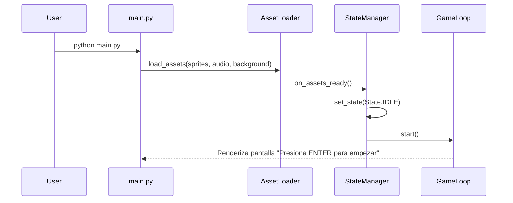
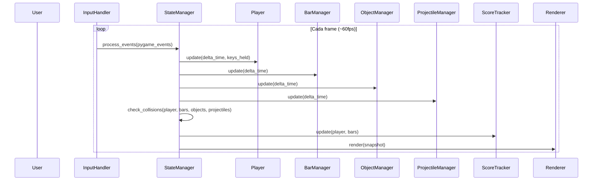
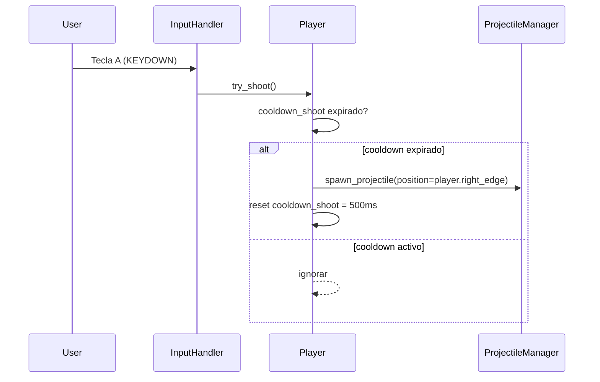
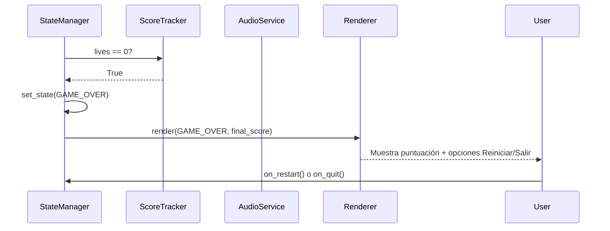

# Design Document: Flappy Kiro — Endless Runner

## Overview

Flappy Kiro es un juego 2D de escritorio desarrollado en Python con **pygame**. El jugador controla a Kiro (sprite `ghosty.png`) moviéndolo libremente en 4 direcciones a través de un escenario con scroll infinito. El objetivo es atravesar los huecos entre Barras_Verdes, recolectar Objetos_Verdes y esquivar Objetos_Rojos, mientras se gestionan vidas y puntuación. El jugador dispone de 3 habilidades especiales (Disparo, Retroceso, Freno) con cooldown individual.

A diferencia del diseño base de referencia (física de gravedad tipo Flappy Bird), este juego utiliza **movimiento cartesiano libre** — Kiro se desplaza en cualquier dirección con las flechas del teclado, sin gravedad. El scroll del escenario y los objetos se mueven independientemente de Kiro.

## Architecture



## Sequence Diagrams

### Game Startup Flow



### Gameplay Loop



### Power Activation — Disparo (A)



### Game Over Flow



## Components and Interfaces

### GameLoop

**Purpose**: Conduce el juego a 60 fps usando `pygame.time.Clock`. Calcula delta time por frame y lo despacha al `StateManager`.

**Interface**:
```python
from abc import ABC, abstractmethod

class GameLoop(ABC):
    @abstractmethod
    def start(self) -> None:
        """Inicia el bucle principal del juego."""

    @abstractmethod
    def stop(self) -> None:
        """Detiene el bucle y cierra pygame."""

    @abstractmethod
    def on_tick(self, delta_time: float) -> None:
        """Llamado cada frame; delta_time en segundos, capado a 0.1s."""
```

**Responsibilities**:
- `pygame.time.Clock.tick(60)` — limitar fps y obtener tiempo transcurrido
- Convertir ms a segundos y caparlo a 0.1s para evitar explosiones de física
- Despachar `state_manager.tick(delta_time)` cada frame
- Pasar eventos `pygame.event.get()` al `InputHandler`

---

### StateManager

**Purpose**: Posee el estado actual (`IDLE`, `PLAYING`, `GAME_OVER`) y orquesta la lógica por frame.

**Interface**:
```python
from enum import Enum, auto
from abc import ABC, abstractmethod

class State(Enum):
    IDLE = auto()
    PLAYING = auto()
    GAME_OVER = auto()

class StateManager(ABC):
    @abstractmethod
    def get_state(self) -> State: ...

    @abstractmethod
    def set_state(self, state: State) -> None: ...

    @abstractmethod
    def tick(self, delta_time: float) -> None:
        """Actualiza todos los subsistemas y ejecuta detección de colisiones."""

    @abstractmethod
    def on_restart(self) -> None:
        """Reinicia todos los subsistemas y transiciona a PLAYING."""

    @abstractmethod
    def on_quit(self) -> None:
        """Cierra la aplicación limpiamente."""
```

**Responsibilities**:
- Solo actualizar subsistemas cuando el estado es `PLAYING`
- Correr detección de colisiones: Kiro↔Barras, Kiro↔Objetos, Proyectil↔ObjetosRojos
- Disparar transición a `GAME_OVER` cuando `ScoreTracker.lives == 0`
- Coordinar el reset completo de Player, BarManager, ObjectManager, ProjectileManager y ScoreTracker en restart

---

### Player

**Purpose**: Representa a Kiro. Gestiona movimiento libre en 4 direcciones, boost, y las 3 habilidades especiales con sus cooldowns.

**Interface**:
```python
from dataclasses import dataclass, field
import pygame

@dataclass
class Player:
    position: Vector2
    bounds: Rect
    sprite: pygame.Surface = field(default=None)

    # Estado de habilidades
    is_braking: bool = False
    brake_timer: float = 0.0       # segundos restantes del freno activo
    cooldown_shoot: float = 0.0    # segundos restantes del cooldown de disparo
    cooldown_dash: float = 0.0     # segundos restantes del cooldown de retroceso
    cooldown_brake: float = 0.0    # segundos restantes del cooldown del freno
    invulnerable_timer: float = 0.0  # segundos restantes de invulnerabilidad

    def update(self, delta_time: float, keys_held: set) -> None:
        """Aplica movimiento según teclas presionadas; respeta estado de freno y límites."""

    def try_shoot(self) -> "Projectile | None":
        """Si cooldown expirado, retorna Projectile y activa cooldown 500ms; si no, None."""

    def try_dash_back(self) -> None:
        """Si cooldown expirado, desplaza X -100px (mín 0) y activa cooldown 1000ms."""

    def try_brake(self) -> None:
        """Si cooldown expirado, activa freno 3s y cooldown 5000ms."""

    def render(self, surface: pygame.Surface) -> None:
        """Dibuja el sprite en la surface."""

    def reset(self) -> None:
        """Restaura posición inicial y limpia todos los cooldowns."""
```

**Responsibilities**:
- Velocidad base: 5 px/frame; con BARRA ESPACIADORA: 10 px/frame
- Movimiento diagonal: aplicar vectores X e Y de forma independiente
- Cuando `is_braking` es True, ignorar todas las teclas de dirección
- Decrementar `brake_timer`, `cooldown_*` e `invulnerable_timer` cada frame según `delta_time`
- Limitar posición a los límites del canvas en todo momento

---

### BarManager

**Purpose**: Genera, desplaza y recicla pares de Barras_Verdes verticales. Cada par tiene una barra superior y una inferior con un hueco de 150–200 px entre ellas.

**Interface**:
```python
from dataclasses import dataclass, field
from typing import List

@dataclass
class BarPair:
    x: float
    gap_y: float       # coordenada Y del centro del hueco
    gap_size: float    # alto del hueco en píxeles (150–200)
    scored: bool = False
    bounds_top: Rect = field(default=None)
    bounds_bottom: Rect = field(default=None)

class BarManager:
    active_bars: List[BarPair]

    def update(self, delta_time: float) -> None:
        """Desplaza barras, genera nuevas según regla de distancia, elimina las fuera de pantalla."""

    def render(self, surface: pygame.Surface) -> None:
        """Dibuja todas las barras activas en verde."""

    def reset(self) -> None:
        """Elimina todas las barras activas."""
```

**Responsibilities**:
- Desplazar barras a la misma velocidad que el scroll del fondo
- Generar nuevo par cuando la distancia entre el par más a la derecha y el borde derecho ≥ 200 px
- Aleatorizar `gap_y` en cada spawn dentro de límites seguros del canvas
- Marcar `scored = True` cuando el borde izquierdo de Kiro supera el borde derecho del par
- Eliminar pares que salgan completamente por el borde izquierdo

---

### ObjectManager

**Purpose**: Gestiona los Objetos_Rojos y Objetos_Verdes que se desplazan por pantalla. Mantiene al menos 1 de cada tipo activo en todo momento.

**Interface**:
```python
from dataclasses import dataclass
from typing import List
from enum import Enum, auto

class ObjectType(Enum):
    RED = auto()
    GREEN = auto()

@dataclass
class GameObject:
    obj_type: ObjectType
    position: Vector2
    bounds: Rect
    speed: float  # px/frame, entre 3 y 8

class ObjectManager:
    active_objects: List[GameObject]

    def update(self, delta_time: float) -> None:
        """Desplaza objetos; reposiciona en borde derecho con Y aleatoria si salen por la izquierda."""

    def render(self, surface: pygame.Surface) -> None:
        """Dibuja objetos: rojo=RED, verde=GREEN."""

    def reset(self) -> None:
        """Reinicia posiciones de todos los objetos."""
```

**Responsibilities**:
- Cada objeto se mueve independientemente a su velocidad propia (asignada aleatoriamente entre 3–8 px/frame en spawn)
- Al salir por el borde izquierdo, reposicionar en borde derecho con Y aleatoria dentro del canvas
- No destruir objetos rojos al colisionar con Kiro — solo el `ScoreTracker` y `AudioService` reaccionan; el `ProjectileManager` es quien los destruye

---

### ProjectileManager

**Purpose**: Instancia y gestiona los proyectiles disparados por Kiro. Detecta colisiones proyectil↔Objeto_Rojo.

**Interface**:
```python
from dataclasses import dataclass
from typing import List

@dataclass
class Projectile:
    position: Vector2
    bounds: Rect
    speed: float = 400.0  # px/s hacia la derecha

class ProjectileManager:
    active_projectiles: List[Projectile]

    def spawn(self, origin: Vector2) -> None:
        """Instancia un proyectil en el borde derecho del sprite de Kiro."""

    def update(self, delta_time: float, red_objects: List[GameObject]) -> List[GameObject]:
        """Mueve proyectiles; elimina proyectiles y objetos rojos en colisión; retorna objetos destruidos."""

    def render(self, surface: pygame.Surface) -> None:
        """Dibuja proyectiles como barras horizontales."""

    def reset(self) -> None:
        """Elimina todos los proyectiles activos."""
```

**Responsibilities**:
- Mover cada proyectil a 400 px/s hacia la derecha
- Eliminar proyectiles que salgan por el borde derecho del canvas
- En colisión (bounding box overlap) con un Objeto_Rojo: eliminar ambos en el mismo frame
- Un proyectil no interactúa con Objetos_Verdes ni Barras_Verdes

---

### ScoreTracker

**Purpose**: Gestiona puntuación y vidas. Aplica penalizaciones, bonificaciones y el bonus de vida cada 1000 puntos.

**Interface**:
```python
class ScoreTracker:
    score: int = 0
    lives: int = 3
    _last_bonus_threshold: int = 0  # último múltiplo de 1000 en que se dio vida

    def add_points(self, amount: int) -> None:
        """Suma puntos; dispara bonus de vida si se cruza múltiplo de 1000 (máx 9 vidas)."""

    def deduct_points(self, amount: int) -> None:
        """Resta puntos; si cae a 0 o debajo, fija en 0 y llama a lose_life()."""

    def lose_life(self) -> None:
        """Decrementa vidas en 1."""

    def reset(self) -> None:
        """Reinicia score=0, lives=3, _last_bonus_threshold=0."""

    def render(self, surface: pygame.Surface) -> None:
        """Dibuja HUD: puntuación y vidas en posición fija."""
```

**Responsibilities**:
- Puntuación mínima siempre 0
- Bonus de vida al cruzar 1000, 2000, 3000... (exactamente una vida por umbral, no retroactivo)
- Cap de vidas en 9
- Notificar al `AudioService` en `add_points` cuando se gana vida (`jump.wav`)
- Notificar al `AudioService` en `deduct_points` por colisión con Objeto_Rojo (`game_over.wav`)
- +5 pts al pasar par de barras, -20 pts por Objeto_Rojo, +100 pts por Objeto_Verde

---

### Background

**Purpose**: Implementa el scroll infinito del fondo usando doble buffer (dos copias de `example-ui.png`).

**Interface**:
```python
class Background:
    scroll_x: float = 0.0
    scroll_speed: float  # px/s, igual a la velocidad de las barras

    def update(self, delta_time: float) -> None:
        """Avanza scroll_x; cuando copia 1 sale por la izquierda, la reposiciona a la derecha de copia 2."""

    def render(self, surface: pygame.Surface) -> None:
        """Dibuja las dos copias del fondo en sus posiciones actuales."""
```

**Responsibilities**:
- Mantener scroll activo incluso cuando el freno de Kiro está activo
- No hay salto visual entre la costura de las dos copias

---

### InputHandler

**Purpose**: Traduce eventos pygame a acciones del juego. Gestiona teclas mantenidas presionadas y teclas de un solo disparo (KEYDOWN).

**Interface**:
```python
import pygame
from typing import Set

class InputHandler:
    keys_held: Set[int]  # teclas actualmente presionadas

    def process_events(self, events: list) -> list[str]:
        """
        Procesa eventos pygame. Retorna lista de acciones disparadas:
        'shoot', 'dash', 'brake', 'restart', 'quit'
        """

    def get_movement_vector(self) -> tuple[int, int]:
        """Retorna (dx, dy) basado en flechas presionadas: valores en {-1, 0, 1}."""

    def is_boost_active(self) -> bool:
        """Retorna True si BARRA ESPACIADORA está presionada."""
```

**Responsibilities**:
- `keys_held` se actualiza con `KEYDOWN` / `KEYUP` para detectar teclas mantenidas (flechas, ESPACIO)
- Acciones de un solo disparo (KEYDOWN): A→'shoot', W→'dash', S→'brake', ENTER→'restart', ESC→'quit'
- Pasar `keys_held` al `Player.update()` cada frame para movimiento fluido

---

### AudioService

**Purpose**: Envuelve `pygame.mixer` con degradación silenciosa si el audio no está disponible.

**Interface**:
```python
class AudioService:
    def play_jump(self) -> None:
        """Reproduce jump.wav (bonus de vida)."""

    def play_penalty(self) -> None:
        """Reproduce game_over.wav (colisión con Objeto_Rojo)."""
```

**Responsibilities**:
- Precargar assets con `pygame.mixer.Sound` al inicializar
- Si un archivo falla, deshabilitar solo ese sonido; el otro continúa funcionando
- `Sound.play()` para reproducción sin bloqueo

---

### AssetLoader

**Purpose**: Carga y cachea todos los assets estáticos antes de que empiece el juego.

**Interface**:
```python
from dataclasses import dataclass
from typing import Dict
import pygame

@dataclass
class AssetManifest:
    images: Dict[str, str]  # {"player": "assets/ghosty.png", "background": "img/example-ui.png"}
    audio: Dict[str, str]   # {"jump": "assets/jump.wav", "penalty": "assets/game_over.wav"}

@dataclass
class AssetCache:
    images: Dict[str, pygame.Surface]
    audio: Dict[str, pygame.mixer.Sound]

class AssetLoader:
    def load(self, manifest: AssetManifest) -> AssetCache:
        """Carga todos los assets. Lanza FileNotFoundError si falta una imagen."""
```

**Responsibilities**:
- Imágenes: `pygame.image.load().convert_alpha()`
- Audio: `pygame.mixer.Sound()` con manejo silencioso de errores
- Lanzar `FileNotFoundError` descriptivo si falta `ghosty.png` o `example-ui.png`

## Data Models

### Vector2

```python
from dataclasses import dataclass

@dataclass
class Vector2:
    x: float
    y: float
```

### Rect (Axis-Aligned Bounding Box)

```python
from dataclasses import dataclass

@dataclass
class Rect:
    x: float      # borde izquierdo
    y: float      # borde superior
    width: float
    height: float

def rects_overlap(a: Rect, b: Rect) -> bool:
    """Retorna True si los dos rectángulos se superponen (bordes que se tocan = sin colisión)."""
    return (
        a.x < b.x + b.width and a.x + a.width > b.x and
        a.y < b.y + b.height and a.y + a.height > b.y
    )
```

### GameConfig

```python
from dataclasses import dataclass, field

@dataclass
class CanvasConfig:
    width: int = 800
    height: int = 600

@dataclass
class PlayerConfig:
    start_x: float = 150.0
    start_y: float = 300.0
    base_speed: float = 5.0         # px/frame
    boost_speed: float = 10.0       # px/frame con BARRA ESPACIADORA
    sprite_width: int = 48
    sprite_height: int = 48
    cooldown_shoot: float = 0.5     # segundos
    cooldown_dash: float = 1.0      # segundos
    cooldown_brake: float = 5.0     # segundos
    brake_duration: float = 3.0     # segundos
    dash_distance: float = 100.0    # píxeles hacia la izquierda
    invulnerability_duration: float = 1.0  # segundos tras colisión con barra

@dataclass
class BarsConfig:
    width: int = 60
    gap_size_min: int = 150
    gap_size_max: int = 200
    spawn_distance: int = 200       # distancia mínima al borde derecho para generar nuevo par
    scroll_speed: float = 180.0     # px/s (sincronizado con Background)
    min_gap_y: int = 120
    max_gap_y: int = 480

@dataclass
class ObjectsConfig:
    size: int = 30                  # dimensión del objeto (cuadrado)
    speed_min: float = 3.0          # px/frame
    speed_max: float = 8.0          # px/frame
    penalty_points: int = 20        # penalización por Objeto_Rojo
    bonus_points: int = 100         # bonificación por Objeto_Verde

@dataclass
class ProjectileConfig:
    speed: float = 400.0            # px/s
    width: int = 20
    height: int = 6

@dataclass
class ScoreConfig:
    points_per_bar: int = 5
    life_bonus_threshold: int = 1000
    max_lives: int = 9
    initial_lives: int = 3

@dataclass
class BackgroundConfig:
    scroll_speed: float = 180.0     # px/s — debe coincidir con BarsConfig.scroll_speed

@dataclass
class GameConfig:
    canvas: CanvasConfig = field(default_factory=CanvasConfig)
    player: PlayerConfig = field(default_factory=PlayerConfig)
    bars: BarsConfig = field(default_factory=BarsConfig)
    objects: ObjectsConfig = field(default_factory=ObjectsConfig)
    projectile: ProjectileConfig = field(default_factory=ProjectileConfig)
    score: ScoreConfig = field(default_factory=ScoreConfig)
    background: BackgroundConfig = field(default_factory=BackgroundConfig)
```

### GameSnapshot

```python
from dataclasses import dataclass

@dataclass
class GameSnapshot:
    state: State
    player: Player
    bar_manager: BarManager
    object_manager: ObjectManager
    projectile_manager: ProjectileManager
    score_tracker: ScoreTracker
    background: Background
```

## Correctness Properties

### Property 1: Velocidad de Kiro acotada
Para cualquier `delta_time` en `[0, 0.1]`s, la velocidad aplicada a Kiro nunca supera `boost_speed` (10 px/frame). Cuando `is_braking` es True, la velocidad es exactamente 0.

**Validates: Requirements 1, 8**

### Property 2: Kiro siempre dentro del canvas
Para cualquier secuencia de inputs, la posición de Kiro siempre satisface `0 ≤ x ≤ canvas.width - sprite_width` y `0 ≤ y ≤ canvas.height - sprite_height`.

**Validates: Requirements 1, 7**

### Property 3: Puntuación nunca negativa
En cualquier estado del juego, `ScoreTracker.score >= 0` es invariante. Las penalizaciones que llevarían el score a negativo lo fijan en 0.

**Validates: Requirements 4, 5**

### Property 4: Vidas acotadas entre 0 y 9
`0 ≤ ScoreTracker.lives ≤ 9` es invariante. Los bonus de vida no se aplican si `lives == 9`.

**Validates: Requirements 4**

### Property 5: Bonus de vida exactamente una vez por umbral
Para cualquier umbral `k * 1000`, si la puntuación cruzó ese umbral exactamente una vez durante la partida, se habrá otorgado exactamente 1 vida adicional por ese umbral.

**Validates: Requirements 4**

### Property 6: Conmutatividad de detección de colisiones
`rects_overlap(a, b) == rects_overlap(b, a)` para cualquier par de rectángulos.

**Validates: Requirements 3, 5, 6**

### Property 7: Scroll del fondo continuo sin saltos
En ningún frame la suma de las posiciones de las dos copias del fondo produce una brecha visible (píxeles no cubiertos) en la pantalla.

**Validates: Requirements 2**

### Property 8: Invulnerabilidad impide pérdidas de vida múltiples
Durante el período de invulnerabilidad de 1s tras una colisión con Barra_Verde, ninguna colisión adicional con Barras_Verdes decrementa las vidas.

**Validates: Requirements 3**

## Error Handling

### Asset Load Failure (imagen crítica)
**Condición**: `ghosty.png` o `example-ui.png` no se encuentra.
**Respuesta**: `AssetLoader` lanza `FileNotFoundError` descriptivo; `main.py` lo captura, imprime el error en consola y cierra pygame limpiamente.
**Recuperación**: El usuario verifica que los assets estén en `assets/` e `img/`.

### Audio No Disponible
**Condición**: `pygame.mixer` no inicializa o un archivo `.wav` no se encuentra.
**Respuesta**: `AudioService` captura la excepción silenciosamente por archivo; el juego continúa sin ese sonido específico.
**Recuperación**: El juego funciona completamente sin audio.

### Ventana Cerrada
**Condición**: El usuario cierra la ventana o el OS termina el proceso.
**Respuesta**: `GameLoop` maneja `pygame.QUIT` y llama `stop()` → `pygame.quit()`.
**Recuperación**: No aplica.

### Frame Spike (ventana inactiva)
**Condición**: `delta_time` aumenta significativamente al restaurar ventana.
**Respuesta**: `GameLoop` capa `delta_time` a 0.1s para evitar teleportación de objetos o posiciones inválidas.
**Recuperación**: El juego retoma normalmente en el siguiente tick.

## Testing Strategy

### Unit Tests (`pytest`)
Lógica pura sin efectos secundarios de pygame:

- `rects_overlap(a, b)` — True/False incluyendo bordes (no colisión), solapamiento parcial y total
- `ScoreTracker.add_points()` — cruce de umbral 1000 exactamente una vez; cap en 9 vidas
- `ScoreTracker.deduct_points()` — puntuación a 0 y pérdida de vida; penalización cuando score ya es 0
- `Player.try_shoot()` — retorna Projectile con cooldown expirado; retorna None con cooldown activo
- `Player.try_dash_back()` — desplaza -100px; clampea a x=0 si estaba en x<100
- `Player.update()` — velocidad correcta con/sin boost; velocidad 0 cuando `is_braking`
- `GameConfig` — valores por defecto en rangos válidos

### Property-Based Tests (`hypothesis`)

- Para cualquier `delta_time` en `[0, 0.1]`, `Player.velocity` nunca supera `boost_speed`
- Para cualquier secuencia de inputs, la posición de Kiro siempre está dentro del canvas
- `ScoreTracker.score` es siempre `>= 0` tras cualquier secuencia de `add_points`/`deduct_points`
- `rects_overlap(a, b) == rects_overlap(b, a)` para rectángulos generados aleatoriamente

### Integration Tests
- Flujo completo: spawn barras → Kiro atraviesa hueco → score +5
- Flujo de Game Over: lives=1 → colisión con barra → lives=0 → estado GAME_OVER
- Flujo de reinicio: estado GAME_OVER → on_restart() → score=0, lives=3, estado PLAYING
- Proyectil destruye Objeto_Rojo: spawn proyectil → colisión → ambos eliminados del mismo frame
- Bonus de vida: score cruza 1000 → lives+1, `jump.wav` reproducido

## Performance Considerations

- **Object pooling**: `BarManager` y `ObjectManager` reciclan objetos en lugar de alocar nuevos cada spawn
- **Surface única**: Todo el rendering en una sola `pygame.Surface`; orden Z: fondo → barras → objetos → proyectiles → Kiro → HUD
- **Target 60 fps**: `pygame.time.Clock.tick(60)`; física basada en delta-time para comportamiento consistente a cualquier tasa de frames
- **Asset caching**: Todos los assets se cargan una vez en `AssetLoader`; no hay I/O durante el gameplay

## Security Considerations

- **Sin red**: El juego es completamente local; no se transmite ningún dato.
- **Sin almacenamiento de datos de usuario**: No se guarda high score ni estado de partida (a diferencia del diseño base de referencia que usaba `scores.json` — esto se omite para simplificar).
- **Sanitización de entrada**: No aplica — la entrada se traduce a vectores de movimiento y acciones discretas; no existe entrada de texto.

## Dependencies

| Dependencia | Propósito | Fuente |
|---|---|---|
| `ghosty.png` | Sprite del personaje Kiro | `assets/ghosty.png` (existente) |
| `jump.wav` | Sonido de bonus de vida | `assets/jump.wav` (existente) |
| `game_over.wav` | Sonido de penalización | `assets/game_over.wav` (existente) |
| `example-ui.png` | Fondo con scroll infinito | `img/example-ui.png` (existente) |
| `pygame` | Rendering, audio, input, game loop | `pip install pygame` |
| `hypothesis` | Tests basados en propiedades | `pip install hypothesis` (dev) |
| `pytest` | Framework de testing | `pip install pytest` (dev) |

No se requieren dependencias de producción más allá de `pygame`. El juego se ejecuta con `python main.py`.
